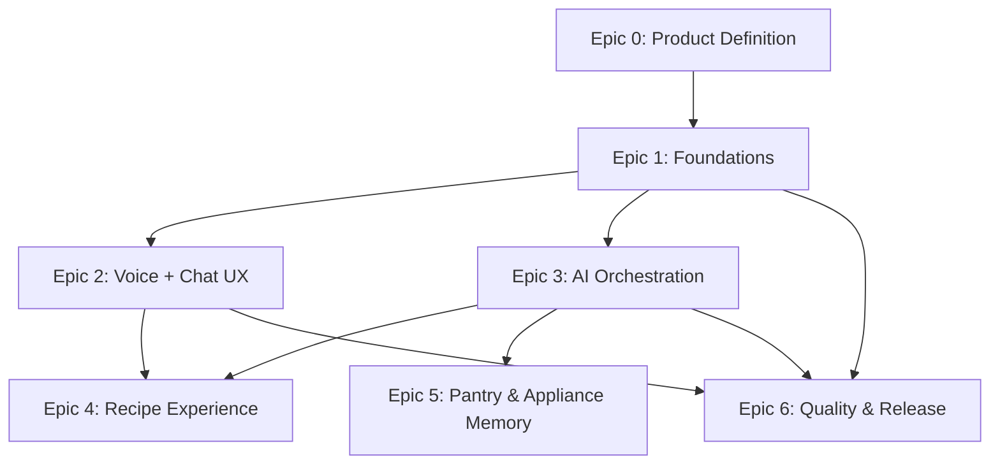

# Project Scope - Nori (SousChef) MVP

## Definition of Done (per Epic)

Epic 0: PRD, UX flow, and screen list are approved and documented.
Epic 1: App boots on iOS/Android with auth, navigation, and data schemas wired.
Epic 2: Voice and text input work, chat UI renders, and loading states are clear.
Epic 3: AI orchestration runs with tool calls, follow-up rules, and allergy filters.
Epic 4: Users can view, open, and save recipes with full steps.
Epic 5: Pantry and appliance inference can be confirmed and persist.
Epic 6: Performance, analytics, and privacy rules meet stated metrics.

## Dependency Map (High Level)

Epic 0 -> Epic 1 (scope and UX flow required before build).
Epic 1 -> Epic 2 (navigation and auth are prerequisites for chat UX).
Epic 1 -> Epic 3 (data models and auth required for AI tooling).
Epic 2 -> Epic 4 (chat and cards required for recipe display).
Epic 3 -> Epic 4 (AI output required for recipe details).
Epic 3 -> Epic 5 (inference relies on AI and pantry schema).
Epic 1 + Epic 2 + Epic 3 -> Epic 6 (quality gates apply after core systems exist).

Legend: Arrows indicate a dependency. For example, `Epic 0 -> Epic 1` means Epic 0 should be completed before starting Epic 1.

## Epic 0 - Product Definition

### T0.1 - PRD alignment review ✅ DONE

Description: Validate MVP scope, success metrics, and non-goals with stakeholders.
Tasks:

- Review `@doc/PRD.md` for accuracy and missing requirements.
- Confirm MVP goals, non-goals, and success metrics.
- Capture explicit out-of-scope items in PRD.
  Acceptance:
- PRD is approved and updated.
- MVP scope and non-goals are documented and agreed.

### T0.2 - UX flow confirmation ✅ DONE

Description: Define the end-to-end UX flow and key screens.
Tasks:

- Document the primary flow: Onboarding -> Ask -> Follow-up -> Results -> Recipe Detail -> Pantry/Preferences.
- List required screens and navigation transitions.
- Define states for loading, empty results, and error handling.
  Acceptance:
- UX flow is written and agreed.
- Screen list and transitions are documented.

## Epic 1 - Foundations

### T1.1 - Repo + app scaffold ✅ DONE

Description: Create the React Native project with basic navigation and environment setup.
Tasks:

- Initialize RN app with TypeScript.
- Set up navigation (stack for onboarding + tabs for main areas).
- Create basic Home/Ask screen placeholder.
- Add environment config handling (dev/staging/prod).
  Acceptance:
- App builds and runs on iOS and Android.
- Navigation between at least two screens works.

### T1.2 - Auth + user profile ✅ DONE

Description: Add user accounts and profile persistence.
Tasks:

- Implement email-based sign up/login (password reset optional).
- Store user profile with locale.
- Add logout and session restoration.
  Acceptance:
- User can sign up, log in, log out.
- Session persists across app restarts.

### T1.3 - Data model setup ✅ DONE

Description: Define core data structures for MVP.
Tasks:

- Define user profile schema (preferences, allergies, pantry, appliances).
- Define recipe schema (ingredients, steps, source note).
- Add saved recipes collection.
  Acceptance:
- Schemas are defined and documented.
- Data can be created, read, and updated via API.

## Epic 2 - Voice + Chat UX

### T2.1 - Voice input (tap-to-talk) ✅ DONE

Description: Implement tap-to-talk voice capture for user input.
Tasks:

- Add mic button with tap-to-toggle recording state.
- Convert speech to text (mock service implemented, ready for real service integration).
- Show transcribed text in the input area.
  Acceptance:
- ✅ Voice input works on iOS and Android (audio recording with expo-audio).
- ✅ Transcribed text appears in the input field (mock transcription for testing).
- ⚠️ Note: Speech-to-text uses mock service; ready for Google Cloud/Azure integration.

### T2.1.1 - MVP voice stack integration ✅ DONE

Description: Wire the selected STT/TTS stack for MVP.
Tasks:

- ✅ Use native iOS/Android speech APIs for speech-to-text (react-native-voicekit integrated).
- ✅ Use native iOS/Android TTS for spoken responses (expo-speech integrated).
- ✅ FR/EN language switching infrastructure implemented.
  Acceptance:
- ✅ Native STT/TTS infrastructure ready (requires `npx expo prebuild` to use).
- ✅ Language selector component created for FR/EN switching.
- ⚠️ Note: Requires custom dev client (not Expo Go). See `@doc/NATIVE_SPEECH_SETUP.md` for setup.

### T2.2 - Text input fallback ✅ DONE

Description: Enable typed prompts for accessibility and quiet use.
Tasks:

- ✅ Add text input field and send button.
- ✅ Reuse the same send pipeline as voice.
  Acceptance:
- ✅ Typed prompt triggers the same response flow as voice.

### T2.3 - Chat UI ✅ DONE

Description: Build the main conversation view.
Tasks:

- ✅ Render user and Nori messages with timestamps.
- ✅ Render recipe cards (title, short summary, time).
- ✅ Provide loading indicator during AI response.
  Acceptance:
- ✅ Chat view displays conversation and recipe cards.
- ✅ Loading state is visible between prompt and reply.

## Epic 3 - AI Orchestration

### T3.1 - Prompting + tool calling layer ✅ DONE

Description: Orchestrate AI responses and structured tool calls.
Tasks:

- ✅ Create system prompt aligned with `@doc/AGENTS.md`.
- ✅ Implement tool calls: get_pantry, update_pantry, get_preferences.
- ✅ Implement recipe generation response parser.
  Acceptance:
- ✅ AI uses tool calls to retrieve pantry and preferences.
- ✅ Structured recipe output is parsed and rendered.

### T3.2 - Follow-up question logic ✅ DONE

Description: Limit and shape follow-up questions.
Tasks:

- ✅ Add logic to allow up to two follow-up questions.
- ✅ Ensure questions are short and ingredient-focused.
- ✅ Always ask if a starch side is desired (rice/potatoes/pasta).
  Acceptance:
- ✅ No more than two follow-up questions per interaction.
- ✅ Starch question is consistently asked.

### T3.3 - Allergy filtering + preferences

Description: Enforce allergy filters and support preferences.
Tasks:

- Apply hard filter for allergy ingredients.
- For preferences, suggest replacements in recipe steps.
  Acceptance:
- Allergens are excluded from all recipes.
- Preference-based substitutions are present where needed.

## Epic 4 - Recipe Experience

### T4.1 - Recipe card list (3-5)

Description: Display multiple recipe options per response.
Tasks:

- Render 3-5 cards with titles and short descriptions.
- Allow user to open a recipe detail view.
  Acceptance:
- Each response shows 3-5 recipes.
- Tapping a card opens details.

### T4.2 - Recipe detail view

Description: Provide full recipe details.
Tasks:

- Show ingredients list and numbered steps.
- Display prep/cook time if available.
  Acceptance:
- Recipe details show clear ingredients and steps.

### T4.3 - Save recipe

Description: Allow users to save recipes.
Tasks:

- Add Save button on recipe detail.
- Persist saved recipes to user profile.
- Add saved recipes list screen.
  Acceptance:
- Saved recipes persist across sessions and devices.

## Epic 5 - Pantry & Appliance Memory

### T5.1 - Pantry inference engine

Description: Infer pantry items from conversation and confirm with the user.
Tasks:

- Detect inferred ingredients from user prompts.
- Present inferred items with confirm/deny toggles.
- Update pantry based on user feedback.
  Acceptance:
- Inferred items are shown and can be confirmed or rejected.
- Pantry updates persist.

### T5.2 - Appliance inference

Description: Track appliances to tailor instructions.
Tasks:

- Provide a simple appliance list (air fryer, instant pot, blender).
- Allow users to confirm or edit inferred appliances.
  Acceptance:
- Appliances are stored and can be edited in settings.

## Epic 6 - Quality & Release

### T6.1 - Performance tuning

Description: Ensure response latency is acceptable.
Tasks:

- Measure end-to-end response time.
- Add caching for pantry/preferences.
- Optimize AI request size.
  Acceptance:
- <5s to first response after speech end in 80% of sessions.

### T6.2 - Analytics (minimal)

Description: Track critical success metrics.
Tasks:

- Track recipe views, saves, and follow-up count.
- Track time-to-first-response.
  Acceptance:
- Events fire for each metric and are visible in analytics.

### T6.3 - Privacy mode

Description: Ensure production does not store raw transcripts.
Tasks:

- Store raw transcripts only in staging/dev.
- Store only structured summaries in production.
  Acceptance:
- Prod build does not persist raw transcripts.
